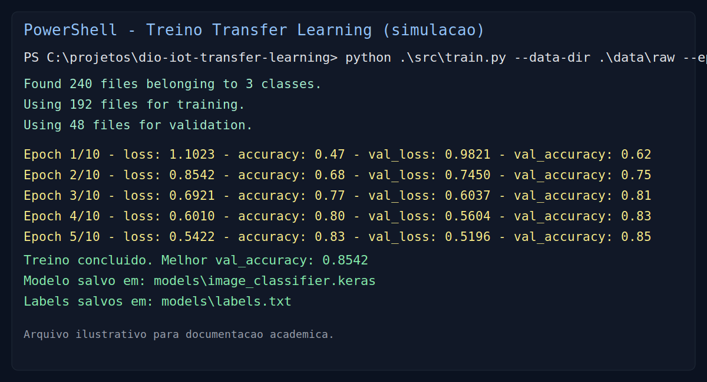
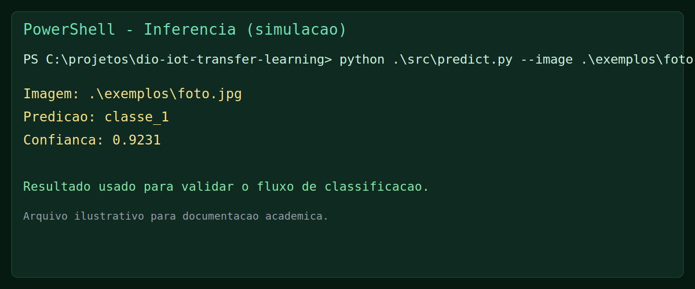
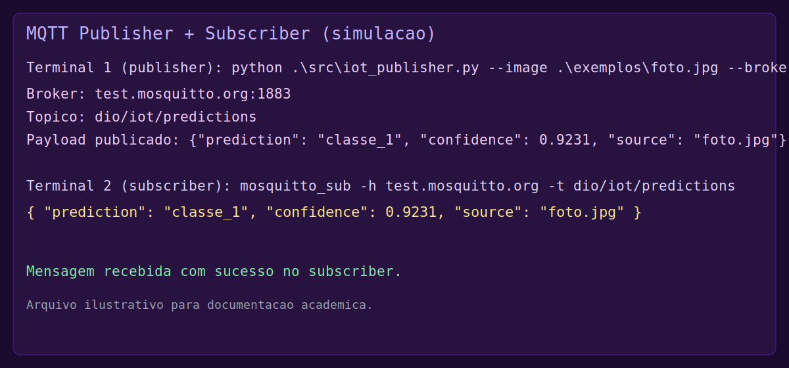

# Reconhecimento de Imagens com Transfer Learning para IoT

Projeto do mini curso da DIO para demonstrar **classificacao de imagens com Transfer Learning** e envio de eventos para uma aplicacao IoT via MQTT.

## Objetivo

Treinar um modelo de classificacao de imagens usando uma rede pre-treinada (MobileNetV2) e simular um fluxo IoT:

1. Capturar/preparar imagens.
2. Classificar imagem em tempo real (ou por arquivo).
3. Publicar resultado em um topico MQTT.

## Estrutura

```text
dio-iot-transfer-learning/
  data/
    raw/                # imagens organizadas por classe
    README.md
  models/               # modelo treinado salvo em .keras
  src/
    train.py            # treino com transfer learning
    predict.py          # inferencia em imagem unica
    iot_publisher.py    # inferencia + publicacao MQTT
  requirements.txt
  README.md
```

## Tecnologias

- Python
- TensorFlow / Keras
- MobileNetV2 (Transfer Learning)
- MQTT (paho-mqtt)

## Como executar

### 1) Criar ambiente virtual (Windows PowerShell)

```powershell
cd "c:\Users\Anizio\Documents\PROGRAMAÇÃO\estudos\perres9\dio-iot-transfer-learning"
python -m venv .venv
.\.venv\Scripts\Activate.ps1
```

### 2) Instalar dependencias

```powershell
pip install -r requirements.txt
```

### 3) Preparar dataset

Organize imagens em `data/raw` com uma pasta por classe.

### 4) Treinar o modelo

```powershell
python .\src\train.py --data-dir .\data\raw --epochs 10 --batch-size 16
```

Saida esperada:

- `models\image_classifier.keras`
- `models\labels.txt`

### 5) Rodar inferencia

```powershell
python .\src\predict.py --image .\exemplos\foto.jpg --model .\models\image_classifier.keras --labels .\models\labels.txt
```

### 6) Simular IoT com MQTT

```powershell
python .\src\iot_publisher.py --image .\exemplos\foto.jpg --broker test.mosquitto.org --topic dio/iot/predictions
```

## Exemplo de payload MQTT

```json
{
  "prediction": "classe_1",
  "confidence": 0.9231,
  "source": "foto.jpg"
}
```

## Evidencias do projeto

Para deixar a entrega mais completa e bem documentada, vale incluir:

- registro do treino com acuracia e perda
- exemplo de inferencia com classe prevista e confianca
- comprovacao de publicacao MQTT (mensagem recebida no subscriber)
- referencias usadas no trabalho (dataset, artigo, Figma, se aplicavel)

### Simulacoes visuais (exemplo para documentacao)

As imagens abaixo sao ilustrativas e representam a execucao esperada do projeto.







## Proximos passos (opcional)

Como evolucao do projeto, algumas ideias interessantes sao:

- integrar captura de camera com ESP32-CAM
- enviar tambem timestamp e device_id no payload
- criar um dashboard simples (Node-RED ou Streamlit)
- aplicar fine-tuning descongelando as ultimas camadas

## Licenca

Uso educacional para o desafio da DIO.
